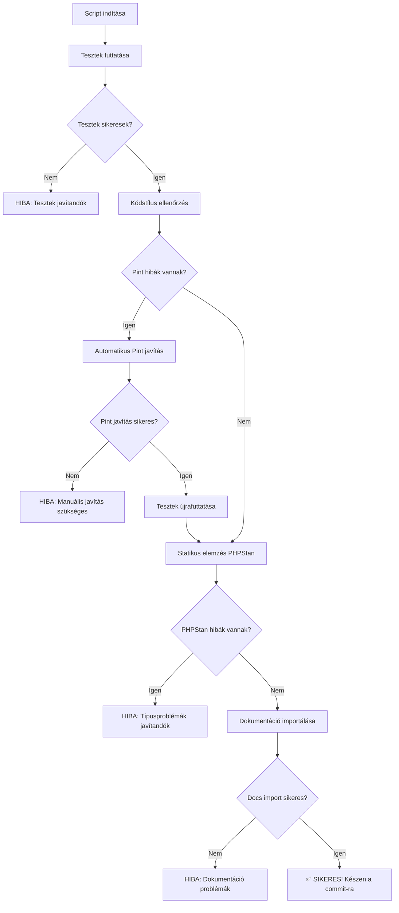

# Quality Check Script Dokumentáció

A `scripts/quality-check.sh` egy átfogó minőségbiztosítási script, amely automatizálja a Laravel projekt tesztelési és kódminőségi ellenőrzéseit.

## 🎯 Cél

Ez a script biztosítja, hogy:
- Minden teszt sikeres legyen
- A kód követi a PSR-12 szabványt
- A statikus elemzés (PHPStan Max Level) hibamentes
- A CI/CD pipeline ne bukjon el kódminőségi problémák miatt

## 📋 Használat

### Alapvető Parancsok

```bash
# Teljes minőségbiztosítási ellenőrzés (ajánlott)
./scripts/quality-check.sh

# Súgó megtekintése
./scripts/quality-check.sh --help

# Csak kódminőség ellenőrzés (tesztek kihagyása)
./scripts/quality-check.sh --skip-tests

# Dokumentáció import kihagyása
./scripts/quality-check.sh --skip-docs

# Csak kódstílus javítás (gyors)
./scripts/quality-check.sh --fix-only
```

### Parancs Opciók

| Opció | Leírás | Használat |
|-------|--------|-----------|
| `--help` | Súgó megjelenítése | `./scripts/quality-check.sh --help` |
| `--skip-tests` | Tesztek kihagyása | Gyorsabb ellenőrzés, ha csak kódminőséget akarsz ellenőrizni |
| `--skip-docs` | Dokumentáció import kihagyása | Ha nem akarsz dokumentáció importot futtatni |
| `--fix-only` | Csak Pint javítás | Ha csak kódstílus hibákat akarsz javítani |

## 🔄 Mit Csinál a Script?

### 1. Teljes Ellenőrzés (`./scripts/quality-check.sh`)



### 2. Lépésről Lépésre

#### 🧪 **1. Tesztek Futtatása**
```bash
./vendor/bin/sail artisan test
```
- Futtatja mind a 161 tesztet
- Biztosítja, hogy minden funkcionalitás működik
- Ha bármelyik teszt bukik, megáll és hibát jelez

#### 🎨 **2. Kódstílus Ellenőrzés és Javítás**
```bash
# Ellenőrzés
./vendor/bin/sail composer lint

# Ha hibák vannak, automatikus javítás
./vendor/bin/sail pint
```
- Ellenőrzi a PSR-12 kódstílus szabványt
- Automatikusan javítja a fixálható hibákat
- Jelzi, ha manuális javítás szükséges

#### 🔍 **3. Statikus Kódelemzés**
```bash
./vendor/bin/sail composer stan
```
- PHPStan Max Level elemzés
- Típusproblémák és logikai hibák keresése
- Megáll, ha bármilyen hibát talál

#### 📚 **4. Dokumentáció Importálása**
```bash
./vendor/bin/sail artisan docs:import --fresh
```
- Automatikusan importálja a `/docs` mappa tartalmát
- Meilisearch indexelés a keresési funkcionalitáshoz
- Biztosítja, hogy a dokumentáció naprakész legyen
- Kihagyható `--skip-docs` opcióval

#### 🔄 **5. Végleges Teszt Futtatás**
- Ha a Pint módosította a kódot, újrafuttatja a teszteket
- Biztosítja, hogy a javítások nem törtek el semmit

## 🚀 Használati Példák

### Fejlesztési Munkafolyamat

```bash
# 1. Fejlesztés
vim app/Models/User.php
# ... kód írása ...

# 2. Quality check
./scripts/quality-check.sh

# 3. Ha minden zöld:
git add .
git commit -m "feat: user model bővítése"
git push origin feature/user-updates
```

### Gyors Kódstílus Javítás

```bash
# Csak kódstílus hibák javítása
./scripts/quality-check.sh --fix-only

# Tesztek nélküli ellenőrzés (gyorsabb)
./scripts/quality-check.sh --skip-tests
```

### CI/CD Pipeline Előtti Ellenőrzés

```bash
# Teljes ellenőrzés a commit előtt
./scripts/quality-check.sh

# Ha sikeres, biztos vagy benne, hogy a CI/CD pipeline is zöld lesz
```

## 📊 Output Példák

### ✅ Sikeres Futtatás

```
🚀 Laravel Boilerplate Quality Check
======================================

🧪 Tesztek futtatása...
✅ Tesztek futtatása sikeres!

🎨 Kódstílus ellenőrzése...
✅ Kódstílus rendben!

🔍 Statikus kódelemzés (PHPStan)...
✅ Statikus kódelemzés (PHPStan) sikeres!

📚 Dokumentáció importálása...
✅ Dokumentáció importálása sikeres!

✅✅✅ MINDEN MINŐSÉGI ELLENŐRZÉS SIKERES! ✅✅✅

📊 Összefoglaló:
   🧪 Tesztek: Sikeres
   🎨 Kódstílus: Megfelelő (PSR-12)
   🔍 Statikus elemzés: Hibamentes (PHPStan Max Level)
   📚 Dokumentáció: Importálva
   ⏱️  Futási idő: 14 másodperc

🚀 Készen állsz a commit-ra és push-ra!

Következő lépések:
  git add .
  git commit -m "feat: új funkció hozzáadása"
  git push origin main
```

### ❌ Hibás Futtatás (Teszt hiba)

```
🚀 Laravel Boilerplate Quality Check
======================================

🧪 Tesztek futtatása...
❌ Tesztek futtatása sikertelen!

❌ A tesztek sikertelenek! Javítsd ki a hibákat és próbáld újra.
```

### ⚠️ Kódstílus Javítás

```
🚀 Laravel Boilerplate Quality Check
======================================

🧪 Tesztek futtatása...
✅ Tesztek futtatása sikeres!

🎨 Kódstílus ellenőrzése...
⚠️ Kódstílus problémák találva, javítás folyamatban...
✅ Kódstílus javítások alkalmazva!

🔍 Statikus kódelemzés (PHPStan)...
✅ Statikus kódelemzés (PHPStan) sikeres!

⚠️ Kódstílus változások történtek, tesztek újrafuttatása...
🧪 Végleges teszt futtatás...
✅ Végleges teszt futtatás sikeres!

✅✅✅ MINDEN MINŐSÉGI ELLENŐRZÉS SIKERES! ✅✅✅
```

## ⚡ Teljesítmény

### Futási Idők

| Ellenőrzés Típusa | Átlagos Futási Idő | Megjegyzés |
|-------------------|-------------------|------------|
| Teljes ellenőrzés | 10-18 másodperc | Tartalmazza a dokumentáció importot |
| `--skip-tests` | 4-8 másodperc | Gyors kódminőség ellenőrzés |
| `--skip-docs` | 6-12 másodperc | Dokumentáció import kihagyása |
| `--fix-only` | 1-3 másodperc | Csak Pint javítás |

### Optimalizációs Tippek

1. **Használd `--skip-tests`-t** kis változtatásoknál
2. **Futtasd teljes ellenőrzést** commit előtt
3. **Használd `--fix-only`-t** kódstílus hibák gyors javításához

## 🛠️ Testreszabás

### Script Módosítása

A script könnyen testreszabható a projekt igényeinek megfelelően:

```bash
# scripts/quality-check.sh módosítása
vim scripts/quality-check.sh
```

### Új Ellenőrzések Hozzáadása

Példa új ellenőrzés hozzáadására:

```bash
# Rector ellenőrzés hozzáadása
if ! run_command "./vendor/bin/sail composer rector" "Rector refaktorálási javaslatok" "🔧"; then
    echo -e "${YELLOW}${WARNING} Rector javaslatokat talált, de folytatjuk...${NC}"
fi
```

### Környezeti Változók

A script respektálja a következő környezeti változókat:

| Változó | Alapértelmezett | Leírás |
|---------|----------------|--------|
| `SAIL_COMMAND` | `./vendor/bin/sail` | Laravel Sail parancs |
| `MAX_EXECUTION_TIME` | `300` | Maximum futási idő (másodperc) |

## 🚨 Hibakeresés

### Gyakori Problémák

#### 1. "Laravel Sail nem található"

```bash
# Megoldás: Győződj meg róla, hogy a projekt gyökérkönyvtárában vagy
pwd
ls -la vendor/bin/sail
```

#### 2. "Permission denied"

```bash
# Megoldás: Add meg a futtatási jogosultságot
chmod +x scripts/quality-check.sh
```

#### 3. Docker nem fut

```bash
# Megoldás: Indítsd el a Docker szolgáltatást
sudo systemctl start docker
# vagy
./vendor/bin/sail up -d
```

### Debug Mód

A script futtatása verbose móddal:

```bash
# Bash debug mód
bash -x ./scripts/quality-check.sh
```

## 📚 További Források

- [Laravel Pint Dokumentáció](https://laravel.com/docs/10.x/pint)
- [PHPStan Dokumentáció](https://phpstan.org/user-guide/getting-started)
- [Laravel Sail Dokumentáció](https://laravel.com/docs/10.x/sail)
- [PSR-12 Kódstílus Standard](https://www.php-fig.org/psr/psr-12/)

## 🤝 Közreműködés

Ha fejlesztési ötleted van a scripthez:

1. Fork-old a projektet
2. Hozz létre egy feature branch-et
3. Módosítsd a scriptet
4. Teszteld alaposan
5. Küldj be egy Pull Request-et

---

**💡 Tipp:** Használd ezt a scriptet minden commit előtt, hogy elkerüld a CI/CD pipeline hibákat és konzisztens kódminőséget tarts fenn!
